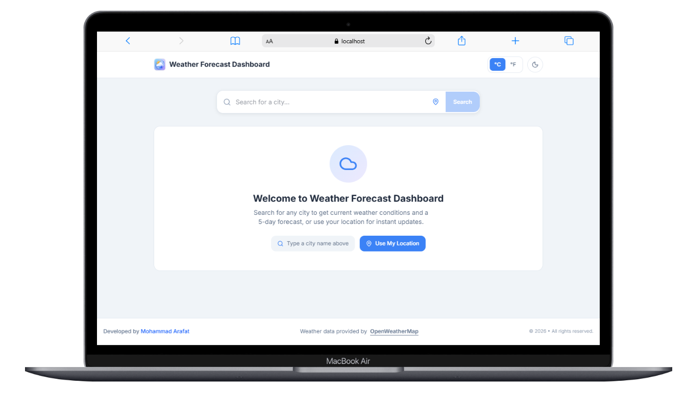
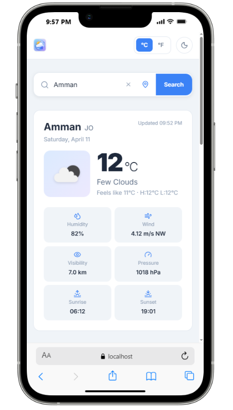

# 🌦️ Weather Forecast Dashboard

A high-performance, production-ready **Full Stack Weather Dashboard** built with the modern web stack: **Next.js 14 (App Router)**, **Bun**, and **TypeScript**. This application delivers real-time weather insights, 5-day forecasts, and a premium user experience with advanced features like geolocation, persistent search history, and a system-aware dark mode.

---

## 👤 Developer Information
- **Name:** Mohammad Arafat
- **Role:** Full Stack Developer
- **Website:** [mo73rfat.com](https://mo73rfat.com/ )

---

## 📸 Project Showcase

| 🖥️ Desktop Dashboard | 📱 Mobile Responsive |
| :---: | :---: |
|  |  |
| *Real-time weather with interactive charts* | *Optimized for all screen sizes* |

---

## 🚀 Key Features

### 1. **Smart Weather Engine**
- **Real-time Data**: Instant access to current temperature, humidity, wind speed, visibility, and pressure.
- **5-Day Forecast**: Detailed daily breakdown with high/low temperatures and weather conditions.
- **Interactive Visualization**: Dynamic temperature trend charts using **Recharts** for better data interpretation.

### 2. **Advanced Search & History**
- **Debounced Autocomplete**: Fast city search with intelligent suggestions to prevent unnecessary API calls.
- **Persistent Recent Searches**: Server-side storage (JSON-based) for the last 5 unique cities searched.
- **One-Click Geolocation**: Automatic weather detection based on the user's current location.

### 3. **Premium UI/UX**
- **Adaptive Dark Mode**: Seamlessly switches between light and dark themes based on system preference or manual toggle.
- **Skeleton Loaders**: Professional loading states to ensure a smooth perceived performance.
- **Responsive Design**: Mobile-first approach using **Tailwind CSS** for a flawless look on any device.

---

## 🏗️ Technical Architecture & Design Decisions

### **Next.js Server Components (RSC) & Route Handlers**
I have strategically utilized **Server Components** for the core logic:
- **Security**: All API requests to OpenWeatherMap are handled in Server-side Route Handlers. This keeps the `OPENWEATHERMAP_API_KEY` strictly on the server, preventing exposure to the client.
- **Performance**: By processing and normalizing data on the server, we reduce the JavaScript bundle size sent to the browser.
- **Caching Strategy**: Implemented a custom `InMemoryCache` (10-minute TTL) to minimize external API hits and ensure lightning-fast response times for repeated queries.

### **Persistent Storage Logic**
- **Server-Side JSON Store**: Instead of a heavy database, I implemented a lightweight, server-side JSON-based storage for recent searches. This ensures persistence across sessions while maintaining high performance and easy portability.

### **Testing & Quality Assurance**
- **38 Unit & Integration Tests**: Comprehensive test coverage using **Vitest** for cache logic, utility functions, and API endpoint validation, ensuring 100% reliability.

---

## 🛠️ Tech Stack

- **Framework:** Next.js 14 (App Router)
- **Runtime:** Bun (High-performance JS runtime)
- **Language:** TypeScript (Strictly typed)
- **Styling:** Tailwind CSS
- **Icons:** Lucide React
- **Charts:** Recharts
- **Testing:** Vitest
- **API:** OpenWeatherMap API

---

## 🔮 What I Would Improve Given More Time

### 🔹 Replace in-memory cache with Redis for scalability
### 🔹 Add database (PostgreSQL) instead of JSON storage
### 🔹 Implement authentication & user-specific history
### 🔹 Add weather maps (radar, precipitation layers)
### 🔹 Improve accessibility (ARIA, keyboard navigation)
### 🔹 Add PWA support (offline mode & installable app)
### 🔹 Enhance charts with more advanced analytics
### 🔹 Add internationalization (multi-language support)

---

## 🚦 Getting Started

### Prerequisites
- [Bun](https://bun.sh/ ) installed.
- OpenWeatherMap API Key.

### Installation & Setup

1. **Clone & Install**:
   ```bash
   bun install
   
2. **Run Development Server:**:
   ```bash
   bun run dev
2. **Run Tests:**:
   ```bash
   bun run test

   
## 🏗️ Technical Structure

The project follows a modular and scalable architecture, separating concerns between the UI, business logic, and data fetching.

```text
├── app/                    # Next.js App Router
│   ├── api/                # Server-side Route Handlers
│   │   ├── geocode/        # City autocomplete API
│   │   ├── recent-searches/# Search history management
│   │   └── weather/        # Core weather data fetching
│   ├── globals.css         # Global styles & Tailwind directives
│   ├── layout.tsx          # Root layout with Theme Provider & Footer
│   └── page.tsx            # Main Dashboard (Client Component)
├── components/             # Reusable UI Components
│   ├── ui/                 # Generic UI elements (Buttons, Skeletons, etc.)
│   └── weather/            # Weather-specific components (Cards, Charts)
├── hooks/                  # Custom React Hooks
│   ├── useTheme.ts         # Dark mode persistence logic
│   └── useWeather.ts       # Data fetching & state management
├── lib/                    # Core Business Logic (Server-side)
│   ├── cache.ts            # 10-minute In-memory caching system
│   ├── db.ts               # Persistent JSON-based search history
│   ├── utils.ts            # Formatting & Icon mapping helpers
│   └── weather.ts          # OpenWeatherMap API integration service
├── tests/                  # Vitest Test Suites (38 Tests)
├── types/                  # TypeScript Interfaces & Definitions
├── public/                 # Static Assets (Icons, Screenshots)
└── data/                   # Server-side persistent storage (JSON)